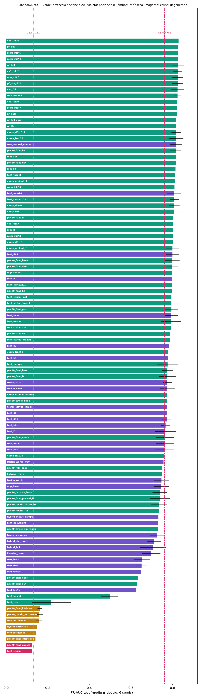
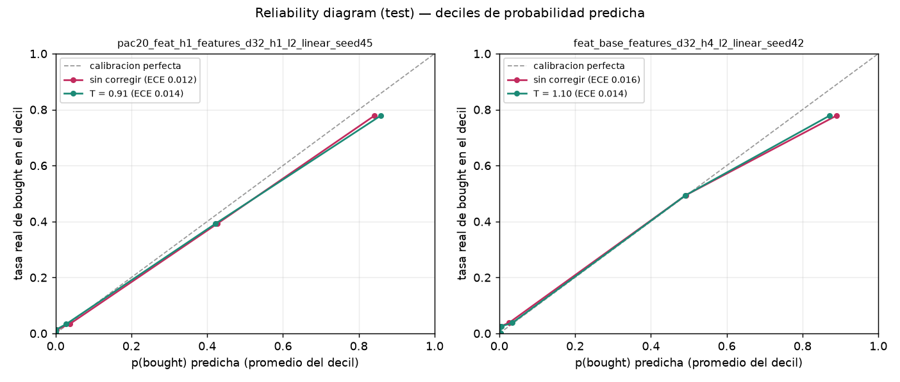
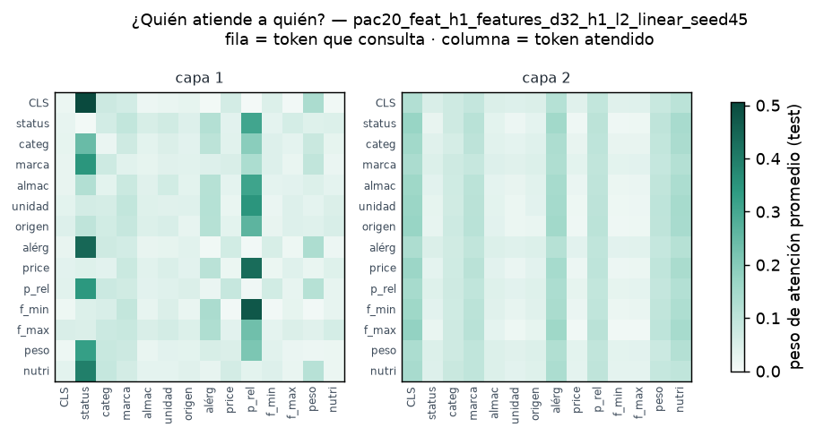
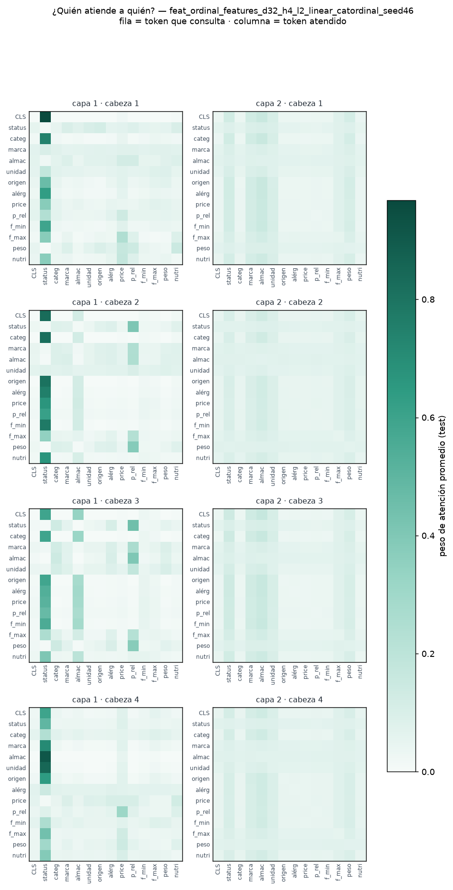
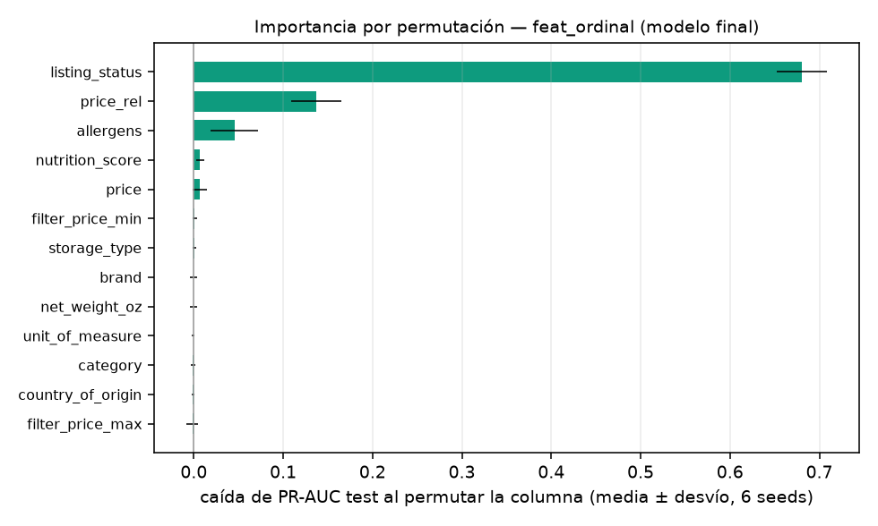
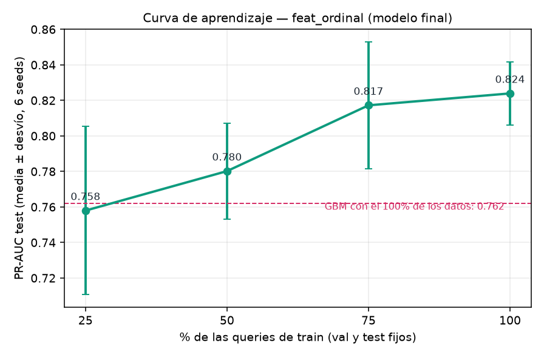

# Análisis de las tandas GPU (16/08)

Primera tanda corrida por Matias en la RTX 3070: las 24 configs de la suite con el protocolo
original (paciencia 8, tope 60 épocas) **y** una variante `pac20_` (paciencia 20, tope 300) para
cada una, seeds 42–47. Total: **288 corridas, 48 grupos × 6 seeds**. Las métricas finales de las
285 corridas con schema viejo se recalcularon desde los checkpoints sin reentrenar
(`eda/recalcula_metricas.py`), así que todos los grupos tienen las 16 métricas en val y test.

Exploración interactiva de todo: [el Laboratorio (panel.html)](panel.html) — curvas por época,
las 16 métricas y ranking clickeable. Vista global:



Convención de este documento: **PR-AUC de test, media ± desvío sobre 6 seeds**; las
comparaciones clave se reportan **apareadas por seed** (misma seed = mismo split, así que el
delta por seed elimina la varianza del split; "gana x/6" = en cuántas seeds el delta es
positivo). Azar = 0.131 (tasa base). Referencia sin red: GBM 0.762, logística 0.660.

## 1. Los resultados principales

| grupo | PR test | qué es |
|---|---|---|
| **pac20_feat_h1** | **0.816 ± 0.026** | el campeón: tabular, 1 cabeza, paciencia 20 |
| pac20_feat_d64 | 0.815 ± 0.027 | d_model 64, paciencia 20 |
| pac20_feat_l4 | 0.803 ± 0.018 | 4 bloques, paciencia 20 |
| pac20_feat_base | 0.798 ± 0.036 | la config base con paciencia 20 |
| feat_base | 0.794 ± 0.033 | la config base (paciencia 8) |
| tower_base | 0.775 ± 0.022 | la mejor de las que ven texto |
| pac20_mlp_base | 0.750 ± 0.033 | el control sin atención |
| pac20_listwise_base | 0.740 ± 0.036 | productos como tokens |
| pac20_hybrid_full | 0.735 ± 0.031 | features + chars en una secuencia |
| text_base | 0.652 ± 0.039 | solo caracteres |
| feat_intrinseco | 0.159 ± 0.014 | sin estado (producto nuevo) ≈ techo GBM 0.162 |
| feat_causal | 0.124 ± 0.006 | degenerado (ver §2.7) |

El transformer tabular **supera al GBM con claridad** (0.816 vs 0.762) — en la medición
preliminar de CPU la ventaja era marginal (0.766); con 6 seeds y el protocolo con más paciencia
quedó establecida.

## 2. Lecturas, con su evidencia

### 2.1 La atención aporta, y no es cuestión de tamaño
transformer vs MLP con la misma entrada, apareado: **Δ = +0.048 ± 0.038, gana 5/6 seeds** —
con el MLP teniendo 4,5× más parámetros (126k vs 28k). Es la respuesta a la pregunta central
del TP.

### 2.2 Paciencia 20 gana en tabular, pierde en texto puro
`pac20_*` mejora o empata el test en **21/24** configs (mayores saltos: listwise +0.041,
feat_h1 +0.037). Pero `text_base` **empeora** (−0.019, gana 1/6) y `text_d64` también (−0.021):
con más paciencia, la selección del mejor checkpoint por val PR-AUC sobreajusta a la validación
en la familia con más varianza. **Decisión**: protocolo paciencia 20 / tope 300 para las
tabulares nuevas; texto queda en paciencia 8. Ninguna corrida tocó el tope de 300 épocas.

### 2.3 Menos cabezas, mejor (a este tamaño)
h1 vs h4 (con pac20): **+0.018 ± 0.028, gana 4/6**. Con d=32, una cabeza de dimensión 32 le
gana a 4 de dimensión 8: la señal dominante es una sola (el tier de estado), y una consulta
"rica" parece valer más que 4 consultas chicas. d64 vs d32: +0.017 (4/6), mismo signo. La
grilla campeón de la 2ª tanda combina estos ganadores (¿h1 y d64 son aditivos o redundantes?).

### 2.4 Los que pierden: mean pooling, pos_weight, bins, PE
- **CLS > mean**: −0.034, mean gana **0/6** — el token de agregación dedicado es mejor que
  promediar (consistente con BERT).
- **pos_weight daña**: −0.059 (gana 1/6). PR-AUC es una métrica de ranking: re-pesar la clase
  positiva no ayuda a ordenar y distorsiona las probabilidades. Se descarta.
- **bins < lineal**: −0.023 (gana 1/6). El FFN ya captura la U invertida del precio; discretizar
  pierde resolución. La hipótesis de §6.2 de la propuesta quedó refutada empíricamente — para
  la presentación es un lindo "lo pensamos, lo medimos, no era".
- **PE en features**: Δ ≈ 0 (−0.004, 3/6) — como predice la teoría: un conjunto de features no
  tiene orden que codificar.

### 2.5 ¿El transformer redescubre la señal del texto? Sí — pero depende de dónde esté la atención
La pregunta de diseño más linda del TP, y la primera tanda la respondió con un contraste limpio:

- **hybrid**: sacarle el token parseado `listing_status` **no le cuesta nada**
  (sin_regex vs full: +0.006 / +0.0005 con pac20) → la atención cruzada recupera desde los
  caracteres crudos lo que nosotros extrajimos con una regex.
- **tower**: sacárselo **le cuesta −0.04/−0.05** (gana 1/6) → cuando el texto tiene que pasar
  por UN embedding de 32 dims antes de encontrarse con lo tabular, la señal no sobrevive
  entera. El cuello de botella es real.

Al mismo tiempo, **ninguna variante con texto le gana al tabular puro** (tower 0.775 < feat
0.794; hybrid 0.735; hybrid vs feat apareado: −0.063, gana 1/6). Con el estado ya parseado como
feature, el texto no agrega — solo diluye (256 tokens de chars compitiendo con 13 tabulares por
la atención). El texto importa en el mundo donde NO parseamos: `text_base` 0.652 está muy por
encima del techo intrínseco (0.16) — el modelo de chars encontró el sufijo solo — pero muy por
debajo del tabular: leer texto crudo con un modelo de 36k parámetros cuesta.

### 2.6 La familia intrínseca confirma el techo
`feat_intrinseco` 0.159 ≈ GBM sin estado 0.162: en el mundo "producto nuevo" nadie puede pasar
de ~0.16 (el 61% de las filas cae en tiers de BTR exactamente cero — no hay señal que aprender).
`text_intrinseco` 0.142 es el MÁS bajo de la familia: el `--strip-status` funcionó — no quedó
ninguna puerta trasera de popularidad en el texto. Las dos familias de la propuesta §2.3.1
quedan medidas de punta a punta.

### 2.7 `feat_causal` no es "peor": está roto por diseño (y es una gran historia)
ROC exactamente 0.500, PR 0.124 = tasa base. Verificado sobre el checkpoint: **predice una
constante** (p = 0.2214 para todo test, desvío 3·10⁻⁸). La causa: con máscara causal, el CLS en
la **posición 0** solo puede atenderse a sí mismo — clasifica sin ver ningún feature. La
moraleja de arquitectura: los decoders (GPT) leen la secuencia desde el **último** token; los
encoders (BERT) pueden poner el CLS adelante porque la atención es bidireccional. La ablación
"¿importa la bidireccionalidad?" recién se puede responder con el CLS al final:
`feat_causal_last` (2ª tanda, ya implementado con `--cls-position last`).

### 2.8 Selección y gap val→test
El gap val−test es ≈ +0.02/+0.03 en casi todos los grupos (sesgo normal de selección por val).
En texto con pac20 sube a ≈ +0.05–0.06 — otra cara del sobreajuste de selección de §2.2.

### 2.9 Calibración (propuesta #3 de Junior): estamos bien
Sobre checkpoints ya entrenados (`eda/calibracion.py`, reliability + ECE + temperature scaling
ajustado en val):

| checkpoint | T | ECE antes → después | BTR real vs predicho |
|---|---|---|---|
| pac20_feat_h1 (mejor val) | 0.91 | 0.012 → 0.014 | 0.123 vs 0.132 |
| feat_base seed42 | 1.10 | 0.016 → 0.014 | 0.134 vs 0.142 |



Lectura: **no hay descalibración grave** (ECE ~0.01, T ≈ 1) — el promedio de p por producto es
un estimador razonable del BTR, con una sobreestimación global de ~+0.9 puntos concentrada en
los deciles altos (el modelo es levemente sobreconfiado con los "ganadores"). Temperature
scaling no mueve la aguja: no hace falta. Queda respondido el "requisito silencioso" que Junior
señaló, con evidencia.

## 3. Decisiones que quedan fijadas

1. **Protocolo**: 6 seeds; tabular con paciencia 20 / tope 300; texto con paciencia 8.
2. **Se descartan**: pos_weight, mean pooling, bins global, PE en features, causal con CLS
   adelante (degenerado).
3. **Campeón provisorio**: `pac20_feat_h1` (0.816). La grilla campeón de la 2ª tanda decide si
   d64/l4 suman sobre h1.
4. Con estado parseado, **el texto no agrega** — la historia del TP es el contraste
   hybrid-recupera / tower-no (2.5), no "texto mejora el número".

## 4. La segunda tanda (ya en la suite; 15 configs nuevas)

Diseñada desde este análisis + los pedidos de Fer (encodings, features descartados) + las
propuestas de Junior (1 y 2; la 3 ya está respondida en §2.9). Todo implementado y smoke-testeado;
`experimentos.py` las corre con las mismas dos líneas de siempre (resume automático: solo corre
lo nuevo).

| config | pregunta que responde |
|---|---|
| `camp_d64h1`, `camp_d64l4`, `camp_h1l4`, `camp_d64h1l4` | ¿los ganadores individuales (d64, h1, l4) suman o se pisan? |
| `feat_causal_last` | causal bien hecho (CLS al final): ¿importa la bidireccionalidad? |
| `feat_target` / `feat_freq` / `feat_hash8` | encodings de categóricas: target suavizado / frecuencia / hashing-módulo (el "modular") |
| `mlp_onehot` | one-hot crudo al MLP: ¿cuánto aporta embeber? (en transformer one-hot ≡ embedding, §6.1) |
| `feat_extras` | volver a meter volumen/package/ingredientes: ¿el EDA tenía razón en descartarlos? |
| `feat_cartaux01/03/05` | multi-task con `cart` como label auxiliar (Junior #2), barrido de λ |
| `listwise_texto` | Junior #1: ¿listwise pierde por la idea o por no ver el texto? (torre de chars dentro del token de producto) |
| `text_len96` | truncar a 96 chars (el título entero, donde vive la señal): atención 7× más barata, ¿mismo resultado? |
| `hybrid_status_campo`, `tower_status_campo` | idea de Fer: el estado SOLO como campo, texto limpio — la celda que faltaba del 2×2 (§4.1) |
| `feat_ordinal`, `feat_status_ordinal`, `feat_status_target` | idea de Fer: encoding del estado CON ORDEN — rango (ordinal) vs magnitud (target), global y solo para `listing_status` (§4.1) |

### 4.1 El estado como campo separado (idea de Fer)

Dos experimentos con una misma motivación: "separar el Best Seller del título y tratarlo como un
campo, con un encoding que tenga sentido, incluso con orden".

**(a) El 2×2 completo.** Con las corridas de la 1ª tanda, hybrid y tower tienen medidas 3 de las
4 celdas de {token parseado sí/no} × {sufijo en el texto sí/no}: *full* (ambos canales,
redundante), *sin_regex* (solo texto) e *intrinseco* (ninguno). Faltaba exactamente la
separación prolija que propone Fer: **texto limpio + estado solo como campo**
(`--strip-status` sin drop). Si `status_campo` > `full`, el sufijo dentro del texto era ruido
puro que diluía la atención; si < `full`, los chars aportaban algo más que el token parseado.

**(b) El orden del campo.** Un orden semántico a mano es indefendible acá — el EDA (§2.3) mostró
que el wording NO predice el tier ("Highly Rated" suena igual que "Top Rated" y compra 50×
menos). Los órdenes defendibles se derivan del BTR de train: **ordinal** = solo el rango del
nivel (normalizado a [0,1]), **target** = rango + magnitud (media suavizada, m=50). Como los
tiers tienen saltos enormes de magnitud (0.65 / 0.03 / 0.000), la hipótesis es
target ≥ ordinal; y el embedding aprendido puede representar cualquiera de los dos, así que
embedding ≥ target es lo esperable — el valor del experimento es medir cuánto se pierde al
comprimir 21 niveles × 32 dims en UN escalar, y la eficiencia de parámetros. Implementado como
encoding **por feature** (`--cat-feature-encoding listing_status=ordinal`): el resto de las
categóricas queda en embedding, así el efecto se aísla.

**En la máquina de la 3070** (tras `git pull`): las dos líneas de siempre —

```bash
.venv/bin/python experimentos.py            # corre SOLO lo nuevo (~20 configs × 6 seeds)
.venv/bin/python experimentos.py --resumen
```

y al terminar: `python panel.py` (re-embebe resultados), commit de `resultados/ pesos/
panel.html` y push. Estimado: las 13 tabulares son segundos por corrida; `listwise_texto` y
`text_len96` son la parte con texto (la más pesada es listwise_texto; `text_len96` es ~7× más
liviana que `text_base`).

## 5. Segunda tanda: resultados (116 corridas)

18 configs × 6 seeds + `listwise_texto` × 2 (la pesada; los 4 seeds restantes corren en la 3ª
tanda por resume automático). Todas con las 16 métricas. Lo importante, apareado por seed:

### 5.1 Campeón nuevo: `feat_ordinal` 0.824 ± 0.018 — la idea del orden, aplicada globalmente
La hipótesis de §4.1 (embedding ≥ target ≥ ordinal) quedó **invertida**: ordinal global
(TODAS las categóricas como su rango de BTR de train) da **0.8239 ± 0.018**, arriba de target
global (0.8134), del mejor embedding (`camp_d64h1l4` 0.8178) y de `pac20_feat_h1` (0.8157) —
además con el desvío más chico. Lectura: el rango inyecta como *prior* el orden que el embedding
tendría que aprender, con muchísimos menos parámetros → menos overfit; y los rangos
equiespaciados en [0,1] están mejor condicionados que las magnitudes de target (0.65/0.03/0.000,
apelmazadas en los extremos). Las versiones solo-status (`feat_status_ordinal/target`) son ≈
neutras: la ganancia viene de simplificar TODAS las categóricas, no solo el estado.
La 3ª tanda combina ordinal con los ganadores de capacidad (`camp_ordinal_*`).

### 5.2 Los contraejemplos de encoding, según lo esperado
`feat_freq` **0.218** (la frecuencia no correlaciona con el BTR: destruye la señal) y
`feat_hash8` **0.498** (las colisiones del módulo mezclan tiers). Moraleja presentable: el
encoding debe *preservar la relación nivel→propensión*; freq y hashing la rompen a propósito.

### 5.3 one-hot le gana al embedding en el MLP (+0.047, 6/6) — matiz honesto al "atención aporta"
`mlp_onehot` 0.797 ≈ `pac20_feat_base` 0.798. El déficit del MLP era en buena parte su
**entrada** (los 416 dims de embeddings entrelazados sobreajustan; el one-hot ralo deja que la
primera capa aprenda pesos por nivel, casi logístico). El enunciado fino pasa a ser: con la misma
representación, la atención aporta +0.048 (5/6); contra el MEJOR MLP posible, el mejor
transformer aporta ~+0.027 (0.824 vs 0.797). La atención sigue ganando, con la vara más alta.

### 5.4 El 2×2 del estado (idea de Fer): el canal doble era ruido para el híbrido
`hybrid_status_campo` (texto limpio + estado como campo) **0.733 > hybrid_full 0.705**
(+0.027, 4/6): el sufijo duplicado adentro del texto diluía. En tower no cambia nada (−0.003)
— su cuello de botella ya aislaba el texto. Y aun limpio, el híbrido queda −0.065 (0/6) bajo el
tabular puro: el texto no suma cuando el estado ya está parseado. El 2×2 queda completo:
full 0.705 · sin_regex 0.711 · **status_campo 0.733** · intrinseco 0.150.

### 5.5 Las propuestas de Junior, medidas
- **listwise_texto (#1)**: +0.016 en 2/2 seeds (0.753 ± 0.005 vs 0.740). El texto ayuda a
  listwise de forma consistente → estaba parcialmente ciego, no mal concebido. Pero sigue ~0.05
  abajo del tabular: la competencia de página es débil (EDA §2.5, re-confirmado).
- **cart-aux (#2)**: U invertida sobre λ (0.1: −0.003 · **0.3: +0.011** · 0.5: −0.007), todo
  dentro del ruido (3/6). Veredicto: no ayuda significativamente — `cart` es casi la misma señal
  que `bought` (bought ⟹ cart), no agrega información nueva al encoder.

### 5.6 Otros
- **Bidireccionalidad: no importa** — `feat_causal_last` 0.795 ≈ base (−0.003, 3/6). El arco
  completo del causal: catástrofe (1ª tanda) → diagnóstico (CLS en pos 0) → fix (CLS al final)
  → respuesta: *da igual*, con 13 tokens de features el orden de lectura no aporta ni quita.
- **Grilla campeón**: los ganadores individuales NO son aditivos (d64+h1 0.800 < h1 solo 0.816);
  solo el combo completo `camp_d64h1l4` empata arriba (0.8178, +0.002, 4/6). Meseta en ~0.82.
- **feat_extras: Δ=−0.006 (3/6)** — volumen/package/ingredientes no aportan: el descarte del
  EDA queda verificado empíricamente, como pidió Fer.
- **text_len96: −0.027 (2/6)** — truncar al título EMPEORA pese a que la señal vive ahí: la
  última oración de la descripción (la copia redundante del estado) ayudaba al modelo chico.
  La redundancia es amiga de los modelos de 36k parámetros.

## 6. Revisión externa (16/08): qué confirma, qué corrige, qué faltaba

Fer trajo la lectura de un agente externo que analizó el enunciado y las clases sin ver nuestro
código. Veredicto punto por punto:

- **Ya lo teníamos** (y ahora con números): FT-Transformer (= formulación A), el menú completo
  de encodings (§5.1–5.3), CLS + su ablación, las tres trampas (cart, split por query, PR-AUC),
  su "5a" (= feat) y su "5c" (la de dos niveles = nuestro listwise; su versión con encoder de
  ítem que incluye texto = exactamente `listwise_texto`, la propuesta #1 de Junior).
- **Corrección conceptual que adoptamos** (va a la presentación): la atención no requiere tokens
  "del mismo tipo", requiere que vivan en el **mismo espacio ℝ^d** — el FeatureTokenizer es lo
  que los proyecta ahí, igual que el embedding en un LLM o los parches en un multimodal.
- **Conexión que no habíamos escrito**: el "column embedding" de TabTransformer (vector
  identificador por columna) es exactamente nuestro `feat_pos` — y su Δ ≈ 0 **confirma
  empíricamente** que en FT-Transformer la identidad de columna ya viene implícita en los
  parámetros propios de cada feature.
- **Su sugerencia de split temporal**: rechazada con evidencia — los timestamps están rotos
  (spans de 2 años dentro de una misma query, EDA §2.6). Sí adoptamos verificar hora/día como
  extras (`feat_tiempo`, 3ª tanda): el EDA dice ruido; que lo diga también un modelo.
- **Lo que sí nos faltaba — su "5b", implementado en la 3ª tanda**:
  1. **Tokenización word-level** (`--text-tokens words`): la clase recomendaba palabras; nuestra
     torre era char-level (la demo). Con palabras, "(Best Seller)" son 2 tokens en vez de 13
     caracteres, y la secuencia baja de 257 a 64 (`text_words`).
  2. **El resumen del texto como UN token del transformer tabular** (`--formulation fusion`):
     la torre comprime el texto a su CLS y ese vector entra como token 15 de la secuencia de
     features — la atención cruza texto↔features al nivel del resumen, **sin que 256 chars
     diluyan** (el mal medido del híbrido, §5.4). Es el punto medio exacto entre hybrid (cruce
     total, diluido) y tower (sin cruce, cuello de botella).
  3. **word2vec pre-entrenado vs end-to-end** (`--w2v-init`): skipgram con negative sampling
     sobre el corpus de train como inicialización del encoder de palabras — la comparación
     clase 1 (embeddings no supervisados) vs clase 2 (end-to-end) que pedía la materia.
- **Su "MLM sobre features"** (enmascarar una columna y predecirla como pre-training): anotado
  como opcional en el panel; el propio agente advierte el scope, y la conexión "pre-entrenar →
  ajustar" ya queda cubierta por w2v-init. Si sobra tiempo, se implementa.
- **Mapas de atención** (insistió, y tenía razón): hechos — `eda/atencion.py`:



**La capa 1 rutea las dos señales del EDA**: el CLS pone el 51% de su atención en `status`
(columna encendida: casi todos los tokens lo consultan) y la familia de precio se consulta entre
sí (la columna `p_rel` brilla para `price` y `f_min` — la señal relacional "¿dónde caigo en el
rango pedido?"). La capa 2 mezcla en forma pareja. Es el gráfico de interpretabilidad del TP:
el modelo mira exactamente donde el EDA dijo que había que mirar.

## 7. Tercera tanda: diseño

| config | pregunta |
|---|---|
| `camp_ordinal_h1` / `_l4` / `_d64h1l4` | ¿el campeón ordinal se combina con los ganadores de capacidad? |
| `feat_tiempo` | hora/día del timestamp como features: ¿el EDA tenía razón en que es ruido? |
| `text_words` | tokenización word-level (64 tokens) vs chars (257): la que "recomendaron" |
| `fusion_base` / `fusion_words` | el resumen del texto como token 15: ¿arregla la dilución del híbrido? |
| `fusion_words_w2v` | embeddings skipgram pre-entrenados vs end-to-end (clase 1 vs clase 2) |
| (`listwise_texto` seeds 44–47) | completa los 6 seeds por resume automático |

## 8. Tercera tanda: convergencia — y modelo final

50 corridas (8 configs × 6 seeds + 2 seeds más de `listwise_texto`, que quedó en 4/6). La
búsqueda **convergió**: ninguna dirección nueva mejora al campeón.

### 8.1 Ordinal no se combina: la simpleza era el punto
Sumarle capacidad al campeón ordinal **empeora todo**: +h1 −0.024 (1/6), +l4 −0.013 (3/6),
+d64h1l4 −0.051 (1/6, desvío enorme 0.066). Coherente con el porqué de su victoria: ordinal gana
por ser un *prior* fuerte con pocos parámetros; agregarle capacidad reintroduce el overfit que
ordinal había eliminado. La grilla cierra: **el mejor modelo es el más simple en los dos ejes**
(capacidad base d32/h4/l2 + encoding escalar).

### 8.2 La elección del modelo final, con disciplina
Por **validación** (la métrica de decisión) hay un empate técnico entre cuatro configs
(Δ < 0.002): `pac20_feat_h1` 0.8364, `camp_d64h1l4` 0.8346, `feat_ordinal` 0.8345,
`camp_d64l4` 0.8343. Val no puede distinguirlas → desempatamos por **parsimonia**: `feat_ordinal`
tiene los menos parámetros (26.177, vs 28k–174k de las otras), el menor desvío entre seeds y el
menor gap val→test (0.011 vs 0.021 de `pac20_feat_h1` — menos sobreajuste de selección). Recién
después miramos test, que lo confirma. **Modelo final del TP:**

> **`feat_ordinal`** — transformer tabular d32 / 4 cabezas / 2 bloques, categóricas con encoding
> ordinal (rango por BTR de train), numéricas lineales, CLS, sin PE, paciencia 20.
> **Test (6 seeds): PR-AUC 0.824 ± 0.018 · ROC-AUC 0.975 ± 0.003 · F1 máx 0.784 (umbral ≈ 0.40)
> · Brier 0.042 · ~64 épocas · 26.177 parámetros.** (GBM: 0.762 · MLP mejor: 0.797.)

Su mapa de atención es todavía más nítido que el del campeón anterior — **capa 1: el CLS pone
0.75 de su atención en `status`** (el escalar ordinal ES la propensión, y el modelo lo sabe);
capa 2 diversifica entre los features secundarios:



### 8.3 El veredicto del 5B: comprimir importa, dónde cruzar no
El resultado más elegante de la tanda. `fusion_base` (chars) **0.775 ± 0.036**:
- vs **híbrido**: **+0.069, gana 6/6** — comprimir el texto a un token elimina por completo la
  dilución; el diagnóstico de la 2ª tanda era correcto y la cura funciona.
- vs **torre**: **Δ = −0.0002** — empate exacto. La atención cruzada al nivel del resumen no
  agrega nada sobre un simple concat. Conclusión de diseño: lo que importa es que el texto llegue
  **comprimido**; *dónde* se encuentra con lo tabular (atención vs concatenación) es indiferente.
- vs **tabular puro**: −0.019 (2/6) — se mantiene la conclusión estructural: con el estado ya
  parseado como feature, el texto no suma. El texto importa solo en el mundo sin regex.

### 8.4 Words y w2v: el vocabulario grande se paga
- Texto puro: palabras ≈ caracteres (−0.006, 3/6) — la secuencia 4× más corta no mejora nada.
- En fusión: palabras **peor** que chars (−0.028, 1/6) — la tabla de embeddings de palabras
  (~vocab 3k × 32) mete 3× más parámetros que todo el resto del modelo, y sobreajusta.
- **w2v-init ayuda a words** (+0.010, 4/6): el pre-entrenamiento skipgram regulariza esa tabla
  grande — la conexión clase 1 → clase 2 funciona en la dirección esperada, aunque no alcanza
  para superar a chars. Moraleja: a esta escala de corpus, el tokenizador chico (chars, vocab 67)
  es el correcto — un punto a favor de la demo de la cátedra.

### 8.5 Cierres menores
- `feat_tiempo` −0.022 (2/6): hora/día no solo no aportan — agregan varianza. Cuarta
  vindicación empírica del EDA (extras, text_len96, tiempo, y la propia familia intrínseca).
- `listwise_texto` con 4 seeds: +0.005 (3/4) — más modesto que con 2 seeds (+0.016); el texto
  ayuda a listwise *algo*, pero la formulación queda lejos del tabular (competencia débil).
  Los seeds 46–47 quedan pendientes por resume si la suite vuelve a correr; no cambian nada.

## 9. Exprimidos post-convergencia (cero GPU: sobre checkpoints existentes)

Tres análisis que no requieren entrenar nada — corren en CPU sobre los 454 checkpoints:

### 9.1 Ensemble de configuraciones: +0.010, gana 6/6 — el número final reportable
Los checkpoints de un mismo seed comparten split, así que se pueden promediar probabilidades y
comparar apareado (`eda/ensemble.py`). Composición elegida por **validación** (disciplina):
`pac20_feat_h1 + feat_target + camp_d64h1l4`. Test: **0.834 ± 0.021**, Δ apareado **+0.0099 ±
0.006, gana 6/6 seeds** — la mejora más consistente de todo el proyecto. Detalle lindo: val NO
eligió a `feat_ordinal` para el ensemble (ordinal y target son escalares correlacionados; el
ensemble prefiere diversidad de representaciones). Resultado final del TP, en dos sabores:
**modelo único `feat_ordinal` 0.824** (despliegue simple, 26k params) · **ensemble de 3: 0.834**
(si solo importa el número).

### 9.2 Importancia por permutación: atención e importancia cuentan LA MISMA historia
`eda/importancia.py` (caída de PR-AUC test al permutar cada columna, media 6 seeds):
`listing_status` **+0.68** · `price_rel` **+0.14** · `allergens` **+0.05** · `nutrition_score`
y `price` ~+0.007 · el resto ≈ 0. Converge exactamente con el mapa de atención del §8.2
(CLS→status 0.75; la familia de precio consulta a p_rel) y con el EDA. Es la respuesta
preparada a la objeción "attention is not explanation": acá tenemos las dos evidencias —
a quién mira (atención) y cuánto duele sacarlo (outcome) — y coinciden.


### 9.3 Métricas por página: el modelo elige bien el producto a promocionar
`eda/metricas_pagina.py`, sobre las ~141 páginas de test con ≥2 productos y ≥1 compra
(media de 6 seeds): **top-1 = 0.912 ± 0.013** (el producto más rankeado fue efectivamente
comprado en el 91% de las páginas; azar esperado: 0.267) · **MRR 0.954** · **NDCG 0.964**.
Es la traducción directa de la PR-AUC al uso de negocio (¿a quién promociono?): elegir el
ganador de la página casi siempre sale bien.

### 9.4 Logística + cross manual: la atención aprende más que "la" interacción
Darle a la regresión logística la interacción del EDA hecha a mano
(one-hot(status) × [price_rel, price_rel²]) la mejora **+0.015 (gana 6/6)**: 0.698 → 0.714
(6 seeds; el 0.660 citado antes era solo seed 42). Pero eso **explica apenas el ~12% del gap**
logística → transformer final (0.126). Conclusión para el informe: la ventaja de la atención no
es "descubrió el cruce precio×tier" — ese cruce existe y suma, pero lo grueso viene de la
composición de muchas no-linealidades chicas. (`eda/cross_manual.py`)

## 10. Cuarta tanda: robustez del modelo final — resultados (90 corridas, 18/08)

15 configs × 6 seeds, todas tabulares. No buscaba superar a `feat_ordinal` (salvo MLM) — lo
interrogaba. Implementación: `--train-frac` (submuestrea queries de train, val/test intactos),
`--init-seed` (separa la seed del modelo de la del split), `--pretrain-mlm` (enmascara una
feature por fila y la predice, cabezas temporarias), `--cv-k/--cv-fold` (GroupKFold por query).

### 10.1 Curva de aprendizaje: casi saturada
25% → 0.758 ± 0.047 · 50% → 0.780 ± 0.027 · 75% → 0.817 ± 0.036 · 100% → **0.824 ± 0.018**.
El último 25% de los datos aporta solo +0.007: la curva está aplanándose — más datos ayudarían
*algo*, pero el gap dominante ya no es de datos. Bonus: con el **75%** de los datos el
transformer ya está en 0.817, arriba del GBM entrenado con el 100% (0.762).



### 10.2 La varianza es mitad split, mitad modelo
Grilla completa 5 inits × 6 splits (`robu_init43..47`): desvío ENTRE splits 0.0233, desvío
entre inits DENTRO de cada split 0.0209 → **~55% de la varianza viene del split, ~45% de la
inicialización**. Dos lecturas: (a) la barra de error del proyecto no es "inestabilidad del
modelo" a secas — la mitad es lotería del split, lo que valida el protocolo de promediar seeds;
(b) la mitad init es exactamente lo que un ensemble puede eliminar → §10.4.

### 10.3 MLM: regulariza a los embeddings, no le agrega nada a ordinal
`feat_mlm20` (embeddings + pre-training): **+0.011 (4/6)** sobre su base → el MLM sobre
features funciona como regularizador, en la dirección esperada. Pero `feat_ordinal_mlm20`:
−0.007 (3/6) — sobre ordinal no hay nada que regularizar que ordinal no regularice ya, más
barato. La hipótesis quedó confirmada: **MLM y ordinal son regularizadores alternativos, y
ordinal es mejor y más simple**. El modelo final no cambia. (El "guiño clase 2" queda hecho y
medido, como pedía la revisión externa.)

### 10.4 Deep-ensemble puro: +0.0095, y el techo se confirma en ~0.834
Promediando las ~6 inits de cada split (`eda/deep_ensemble.py`): **0.8334 ± 0.022, Δ +0.0095
(gana 5/6)**. Convergencia notable: el ensemble de 3 configs distintas (§9.1) dio 0.8339 y el
de 6 inits idénticas da 0.8334 — **dos rutas de ensemble independientes aterrizan en el mismo
~0.834**, que queda como el techo práctico de este esqueleto sobre este dataset.

### 10.5 GroupKFold: el número final, con intervalo fino
5 folds × 6 seeds = 30 mediciones de test: **0.8207 ± 0.0119** (media de las 6 CV completas;
las 30 mediciones crudas: ± 0.027). Consistente con el holdout (0.824 ± 0.018) y con intervalo
más angosto. Número de cabecera para el informe: **PR-AUC ≈ 0.82 (CV5×6), 0.834 en ensemble**.

## 11. Quinta tanda (diseño): pesos por feature dentro del transformer — idea de Fer

Pregunta: en un transformer estándar, W_q/W_k/W_v y la FFN se **comparten entre posiciones** —
el sesgo inductivo correcto para texto, donde una posición no significa nada fijo. Pero en
nuestra formulación **la posición ES el feature** (token 1 = status, siempre). ¿Hace falta el
weight-tying cuando el conjunto es fijo? La idea de Fer: desatarlos — cada feature con su propio
W_q/W_k/W_v (hace sus propias "preguntas") y/o su propia FFN (13+1 MLPs, una por posición). Es
la extensión natural de la identidad-por-parámetros que ya usamos en la ENTRADA (el
FeatureTokenizer) hacia adentro de los bloques. No es el estándar de ningún transformer tabular
que conozcamos (FT-Transformer/TabTransformer/SAINT comparten): como mínimo, una ablación fresca.

Implementación: `--per-feature {qkv,ffn,both}` (`HeadPorFeature` y `FeedForwardPorFeature` en
`btr/model.py`, vía einsum con pesos (T, d, ·); solo formulation features, sin causal). Costos:
26k → 106k (qkv) / 245k (ffn) / 323k (both) parámetros.

**Hipótesis registrada antes de correr**: todo este TP dice que en 10k filas gana el prior
simple sobre la capacidad (ordinal > embeddings; la grilla de capacidad en meseta; MLM sin
efecto sobre ordinal) → lo esperable es que **no supere a 0.824 por overfitting**, quizá con
la variante qkv (la más barata) como la menos mala. Si gana, es un hallazgo de verdad; si
pierde, cierra la pregunta del sesgo inductivo con evidencia. Configs: `pf_qkv`, `pf_ffn`,
`pf_full` (sobre el campeón ordinal) y `pf_full_emb` (sobre embeddings: ¿el desatado suple la
identidad que ordinal inyecta?).

### 11.1 El contrapeso (idea de Fer, 21/08): reducir la complejidad

La tanda se completa con la dirección opuesta, para que el contraste alrededor del campeón sea
un espectro y no un solo lado:

- **Minimalismo** (`min_d16/d8/l1/d16l1`): achicar SOBRE ordinal — nunca lo probamos (la grilla
  d8/d16 de la 1ª tanda era sobre embeddings). `min_d16` tiene **6.945 parámetros**; si empata
  al campeón, la historia "el prior simple gana" llega a su versión final.
- **Especialización barata** (`pf_gate`): compuertas diagonales por posición sobre los W
  compartidos — `q_t = (x_t ⊙ g_t)·W_q` — con init en 1: **arranca siendo exactamente el
  campeón** (verificado: predicciones idénticas en la inicialización) y aprende solo la
  desviación por feature. +11k parámetros (vs +80k del desatado).
- **Desatado compensado** (`pf_qkv_d16`): per-feature completo pero en d16 → **26.913
  parámetros ≈ los 26.177 del campeón**. La comparación controlada de la tanda: misma cantidad
  de parámetros, ¿conviene *especializar* o *compartir*?

Espectro final de la tanda (parámetros): 6.9k (min_d16) · 26k (campeón) · 27k (pf_qkv_d16) ·
37k (pf_gate) · 106k (pf_qkv) · 245k (pf_ffn) · 323k (pf_full).

### 11.2 Resultados (60 corridas, 21/08): la hipótesis, corregida en ambas direcciones

**El desatado NO destrona al campeón — pero tampoco colapsa por overfitting** (la hipótesis
pre-registrada era demasiado pesimista: early stopping + weight decay lo contuvieron):
`pf_qkv` 0.8284 (+0.0045, 3/6), `pf_full` 0.8262 (+0.0023, 3/6) — empates dentro del ruido;
solo `pf_ffn` (el de más parámetros por lejos) queda abajo (−0.0061, 2/6).

**El hallazgo real está en `pf_full_emb`: +0.0205, gana 6/6** sobre los embeddings compartidos.
La idea de Fer FUNCIONA — desatar los pesos aporta identidad/especialización por feature — pero
su beneficio es **redundante con el prior ordinal**: sobre embeddings (que no traen ese prior)
ayuda consistentemente; sobre ordinal, no queda nada que aportar. Misma estructura lógica que
el MLM de la 4ª tanda: otro regularizador/especializador alternativo, y el prior simple ya
ocupaba ese lugar. Refuerzo de la comparación controlada: a d16 fijo, especializar > compartir
(`pf_qkv_d16` vs `min_d16`: +0.0094, 4/6).

**El contrapeso minimalista dejó el titular de la tanda: `min_d16l1` — d16, UN bloque,
3.713 parámetros — EMPATA al campeón** (val 0.8350 vs 0.8345; test 0.8254 ± 0.026 vs
0.8239 ± 0.018; +0.0015 apareado, 3/6). El modelo final admite compresión **7×** sin pérdida
medible; la historia "el prior simple gana" llega a su forma final: un transformer de 4k
parámetros con encoding ordinal iguala todo lo que probamos. (`min_d16` solo pierde −0.0085 con
6.9k; `min_l1` muestra que la profundidad se extraña más que el ancho: −0.023 con varianza alta.
`pf_gate`: las compuertas no encuentran desviación que valga: −0.0036.)

**Lección metodológica para la defensa — el sobreajuste de selección, ilustrado en vivo**:
`pf_ffn` tiene la MEJOR validación de todo el proyecto (0.8435) y NO es mejor en test (0.8179);
su gap val→test (0.026) es 2,5× el del campeón (0.011). Con 100+ configuraciones probadas, "la
mejor val" degrada como criterio — exactamente por eso la selección del modelo final se cerró
en la 4ª tanda con su procedimiento pre-registrado (empate en val → parsimonia), y las tandas
5 en adelante son **exploratorias**: prueban hipótesis, no re-abren la selección. **El modelo
final NO cambia** (`feat_ordinal`); `min_d16l1` queda registrado como su versión comprimida
equivalente — utilizable como respuesta si preguntan "¿es lo más chico posible?".

## 12. Pendientes analíticos

- ~~Mapas de atención del campeón~~ → hechos (§6, §8.2).
- Métricas por página (top-1 de la query, NDCG) — eje "pedir" en el panel.
- GroupKFold si queremos intervalos más finos para la presentación.
