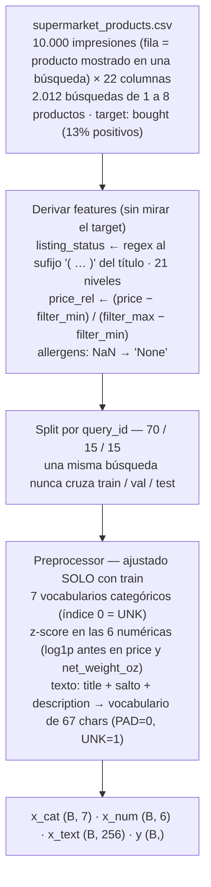
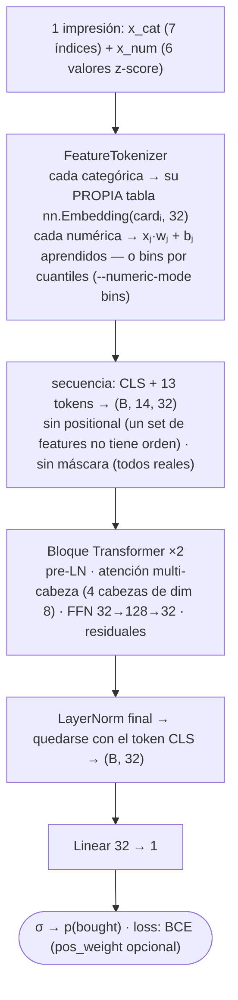
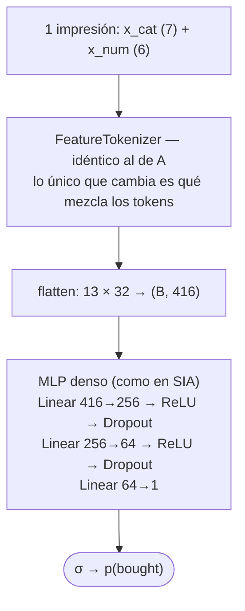
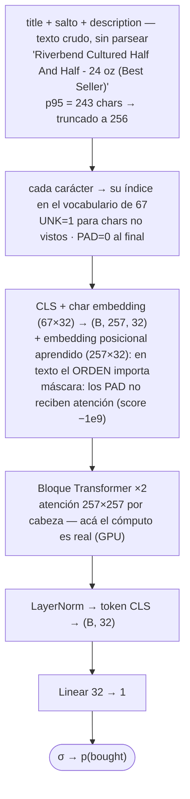
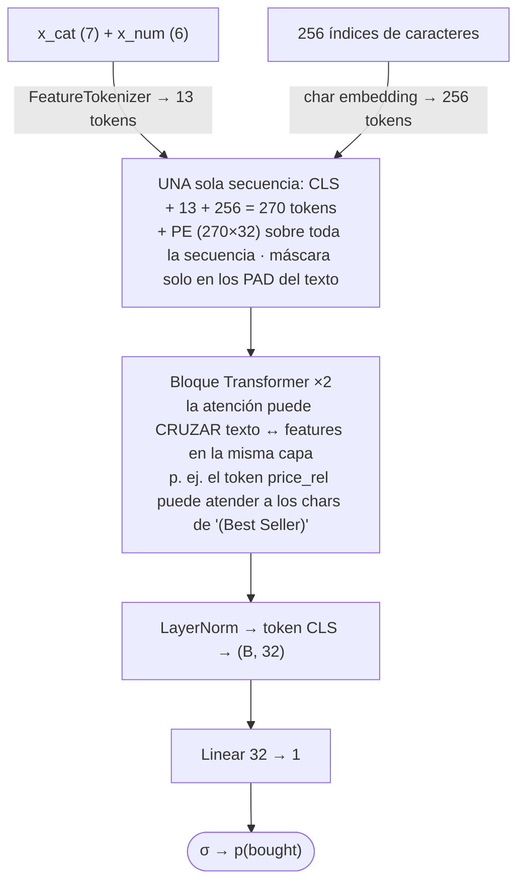
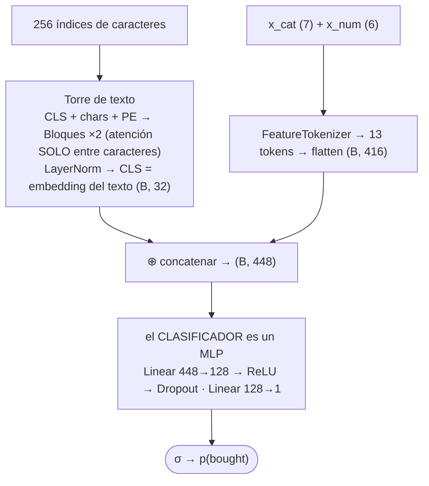
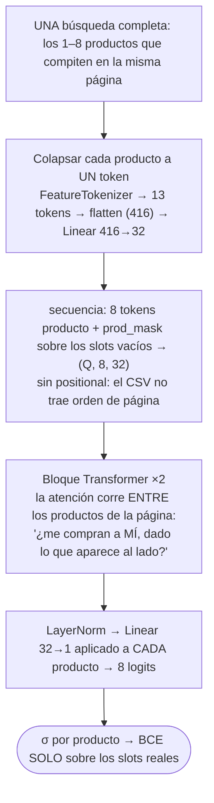

# Diagramas de las arquitecturas

Referencia visual de las **seis arquitecturas** implementadas en `btr/model.py`, completas: de la
fila del CSV a `p(bought)`. Las dimensiones son las reales del código con la config base
(`d_model=32`, 4 cabezas de dim 8, 2 bloques). GitHub renderiza los diagramas solo; las
justificaciones de cada decisión están en `propuesta.md` (§4 formulaciones, §5 arquitectura) y la
suite que las corre a todas es `experimentos.py`.

Convención: `(B, 14, 32)` = (batch, cantidad de tokens, d_model). Todas comparten el
preprocesamiento (panel 0) y el protocolo (split por query 70/15/15, AdamW 1e-3, early stopping
por PR-AUC de validación, 3 seeds).

## 0. Preprocesamiento compartido (`btr/data.py`)

Quedan **afuera de la entrada**: `cart` (leakage: bought ⟹ cart al 100%), `query_id` (solo
particiona), `timestamp` (ruido), `package_size` y `dimensions_in` (redundantes con el peso),
`filter_category` y `filter_storage_type` (los productos siempre los cumplen; el rango de precio
sí entra vía `price_rel`), `ingredients` (v1).

## A. Transformer tabular — cada feature es un token

`--arch transformer --formulation features` · 14 tokens · 28.289 parámetros · estilo FT-Transformer

Responde: **¿la atención entre features aporta?** (interacciones tipo price_rel × categoría).
Primer resultado (seed 42): PR-AUC test **0.766**.

## Baseline MLP — mismos embeddings, sin atención

`--arch mlp` · 126.209 parámetros (4,5× el transformer tabular)

Es el **control** del experimento: si el transformer no le gana, la atención no se justifica.
Primer resultado: 0.715 < 0.766 pese a tener 4,5× más parámetros.

## C. Transformer de texto — cada carácter es un token (la demo, adaptada)

`--arch transformer --formulation text` · 257 tokens · 35.713 parámetros

Es la adaptación directa de la demo de la cátedra: de *decoder que genera el próximo carácter*
(máscara causal, 65 logits por posición) a *encoder que clasifica* (bidireccional, CLS, 1 logit).
Nadie le parsea nada: tiene que descubrir sola que la señal vive en el sufijo del título y en la
última oración de la descripción.

## A+C. Transformer híbrido — features y caracteres en una misma secuencia

`--arch transformer --formulation hybrid` · 270 tokens · 39.073 parámetros

La variante `hybrid_sin_regex` saca el token `listing_status` parseado y pregunta: ¿la atención
recupera sola desde los caracteres lo que extrajimos con la regex?

## C2. Torre de texto + MLP — el transformer solo hace embeddings

`--arch tower` · 257 + 13 tokens · 96.225 parámetros

La diferencia con el híbrido es exactamente una: acá texto y tabular **se encuentran recién
después de la atención** (en el concat), así que la atención nunca puede mirar un feature. Si el
híbrido gana, el cruce dentro de la atención vale; si empatan, alcanza con el transformer como
módulo de embedding (estilo BERT, clase 2).

## B. Transformer de página (listwise) — cada producto de la query es un token

`--arch listwise` · 8 tokens (el batch es en búsquedas) · 41.601 parámetros

La única formulación que ve la página completa y puede capturar competencia. Primer resultado:
0.664 — consistente con el EDA (§2.5: la competencia acá es débil).

## Eje transversal: dos familias (no son arquitecturas nuevas)

Sobre casi todas las de arriba corren **dos variantes de entrada** que resuelven la discusión del
"(Best Seller)" (`propuesta.md §2.3.1`):

| familia | qué usa | flags | simula |
|---|---|---|---|
| **catálogo** | todo, incluido el estado del listing | (ninguno) | rankear el catálogo actual |
| **intrínseco** | recorta el estado: el token parseado Y su copia en el texto | `--drop-features listing_status --strip-status` | el producto nuevo, sin historial |

El techo medido con GBM anticipa la diferencia: PR-AUC 0.762 con estado vs 0.162 sin estado.
En la suite: `feat_intrinseco`, `text_intrinseco`, `hybrid_intrinseco`.

## Las seis, lado a lado

| arquitectura | un token es… | secuencia | la atención cruza | parámetros | PR-AUC test (seed 42) | comando |
|---|---|---|---|---|---|---|
| A · tabular | un feature | 14 | features ↔ features | 28.289 | 0.766 | `--formulation features` |
| MLP (control) | — (sin atención) | 416 flat | — | 126.209 | 0.715 | `--arch mlp` |
| C · texto | un carácter | 257 | chars ↔ chars | 35.713 | esperando la 3070 | `--formulation text` |
| A+C · híbrido | feature o carácter | 270 | texto ↔ tabular | 39.073 | esperando la 3070 | `--formulation hybrid` |
| C2 · torre | un carácter (en la torre) | 257 + 13 | solo chars ↔ chars | 96.225 | esperando la 3070 | `--arch tower` |
| B · listwise | un producto entero | 8 | producto ↔ producto | 41.601 | 0.664 | `--arch listwise` |

Referencias sin red: GBM 0.762, regresión logística 0.660 (mismo split, `eda/verificaciones.py`).
El transformer tabular ya supera al GBM y al MLP con 4,5× sus parámetros: primera evidencia de
que la atención aporta. Las tres de texto son la parte cara y corren en la suite de la 3070.
